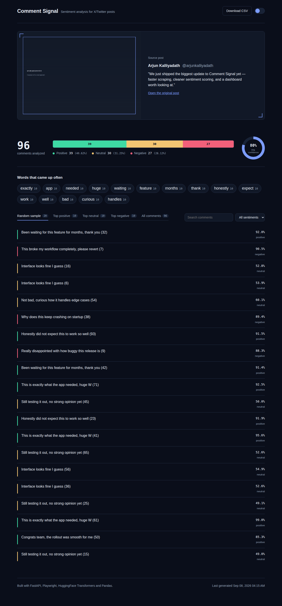

# Tweet-Pulse — Twitter/X Sentiment Analyzer

Point it at a tweet, and it pulls the replies, scores each one for sentiment, and lays the whole conversation out on a dashboard: how people reacted, which comments actually drove that reaction, and what the post looked like in the first place.



## Contents

- [How it works](#how-it-works)
- [Dashboard features](#dashboard-features)
- [Setup](#setup)
- [Running it](#running-it)
- [Troubleshooting](#troubleshooting)
- [Project structure](#project-structure)
- [Notes and limitations](#notes-and-limitations)

## How it works

The project is three small stages that hand off to each other through plain CSV/JSON files — no database required.

```
extract_comments.py   ──▶  comments.csv, tweet_meta.json, static/tweet_screenshot.png
sentiment_comments.py ──▶  sentiment_results.csv
app.py (dashboard)     ──▶  reads sentiment_results.csv + tweet_meta.json
```

1. **`extract_comments.py`** attaches to a Chrome window you already have open and logged into X/Twitter, opens the tweet you give it, and scrolls through the replies collecting comment text. It also grabs the original post's text, author and a screenshot, so the dashboard can show what the comments are actually about.
2. **`sentiment_comments.py`** runs every collected comment through [`cardiffnlp/twitter-roberta-base-sentiment-latest`](https://huggingface.co/cardiffnlp/twitter-roberta-base-sentiment-latest), a RoBERTa model tuned specifically for short, informal social media text, and saves a `positive` / `neutral` / `negative` label with a confidence score for each one.
3. **`app.py`** is a FastAPI app that reads the results and serves the dashboard.

## Dashboard features

- **Source post card** — the original tweet's text, author and a screenshot, so you're never reading reactions out of context.
- **Composition bar + confidence dial** — total comments analyzed, the positive/neutral/negative split, and the model's average confidence across all of them.
- **Trending words** — the terms that came up most often across all the replies.
- **Random sample, and top 10 per sentiment** — rather than one long undifferentiated table, you get a random cross-section of 20 comments plus the 10 highest-confidence comments in each sentiment category, so you can quickly read what a strongly negative reply actually looks like versus a strongly positive one.
- **Full searchable list** — every comment, filterable by sentiment and free-text search.
- **CSV export** and a **light/dark theme toggle**.

## Setup

You need Python 3.10+ and Google Chrome installed. Do this once.

**1. Get the code and open a terminal in the project folder.**

**2. Create and activate a virtual environment.**

```bash
python -m venv venv
```

```bash
# Windows (PowerShell)
.\venv\Scripts\Activate.ps1

# macOS / Linux
source venv/bin/activate
```

Your terminal prompt should now start with `(venv)`.

**3. Install the Python dependencies.**

```bash
pip install -r requirements.txt
```

`transformers` and `torch` are large (a few hundred MB combined) — this can take a few minutes.

**4. Install the Playwright browser.**

```bash
playwright install chromium
```

This downloads a standalone Chromium build that Playwright drives separately from your regular Chrome. Also one-time, also needs internet.

Setup is done. You won't need to repeat any of the above unless you delete `venv/` or change `requirements.txt`.

## Running it

Every time you want to analyze a tweet, do these four steps in order.

**1. Fully close Chrome.** Every window — and check there's no `chrome.exe` left in your Task Manager (Windows) or Activity Monitor (Mac) in the background. This matters: if Chrome is already running, a new launch won't pick up the debugging flag below.

**2. Open Chrome with remote debugging enabled**, in a separate terminal window (leave it running):

```bash
# Windows (PowerShell)
& "C:\Program Files\Google\Chrome\Application\chrome.exe" --remote-debugging-port=9222

# macOS
open -a "Google Chrome" --args --remote-debugging-port=9222

# Linux
google-chrome --remote-debugging-port=9222
```

Log into x.com in that window if you aren't already logged in.

**3. Collect comments from a tweet.** Back in your `(venv)` terminal:

```bash
python extract_comments.py
```

When it asks for a URL, paste the **plain tweet URL** — just `https://x.com/<user>/status/<id>`, not a link ending in `/photo/1` or `/video/1`, which opens a media overlay instead of the normal page. It scrolls the replies for a while and stops automatically once nothing new shows up, then writes `comments.csv`, `tweet_meta.json`, and a screenshot of the original post.

**4. Run sentiment analysis:**

```bash
python sentiment_comments.py
```

The very first run downloads the model and caches it locally, so it pauses for a bit; every run after that is fast. This writes `sentiment_results.csv`.

**5. Launch the dashboard:**

```bash
uvicorn app:app --reload
```

Open **http://127.0.0.1:8000** in your browser. To analyze a different tweet later, just repeat steps 3–4 (you can leave the dashboard running and refresh the page).

## Troubleshooting

**`Could not connect to Chrome on port 9222`**
Chrome was already running before you added the flag. Close every Chrome window, confirm no `chrome.exe` process is left in Task Manager/Activity Monitor, then relaunch it with the `--remote-debugging-port=9222` command above. You can double-check it worked by visiting `http://127.0.0.1:9222/json/version` in that window — you should see raw JSON, not an error.

**Comment collection returns 0 or very few comments**
X/Twitter changes its page structure occasionally, which can break the selectors `extract_comments.py` looks for. Also double check you passed the plain status URL, not a `/photo/…` or `/video/…` link.

**The dashboard shows "No analysis yet"**
That means `sentiment_results.csv` doesn't exist yet in the project folder — run steps 3–4 above first.

**`pip install` seems to hang on `torch`**
It's genuinely a large download (\~200MB+); give it a few minutes, especially on a slower connection.

## Project structure

```
Tweet-Pulse/
├── app.py                  # FastAPI dashboard
├── extract_comments.py     # Scrapes replies + captures the source post
├── sentiment_comments.py   # Runs sentiment classification
├── requirements.txt
├── templates/
│   └── index.html
├── static/
│   ├── style.css
│   └── script.js
└── assets/
    └── dashboard-preview.png
```

## Notes and limitations

- **Selectors will drift.** `extract_comments.py` relies on X/Twitter's internal `data-testid` attributes, which the site changes without notice. If comment collection suddenly returns nothing, that's the first place to check.
- **This scrapes a UI, not an API.** Use it on your own posts or for personal research, be mindful of X/Twitter's Terms of Service, and don't hammer it with rapid repeated runs.
- **English-only model.** `twitter-roberta-base-sentiment-latest` is trained on English tweets; sentiment on other languages will be unreliable.
- **`torch` is a large dependency.** If you only care about the dashboard and already have `sentiment_results.csv` from elsewhere, you can skip installing `transformers`/`torch` and just run `app.py`.

## Tech stack

Python, FastAPI, Playwright, HuggingFace Transformers, Pandas, and a hand-built HTML/CSS/JS dashboard (no frontend framework, no chart library).

## Author

**Arjun K**
- GitHub: [@Arjunkalliyadath](https://github.com/Arjunkalliyadath)
- Email: arjunkalliyadath2001@gmail.com
